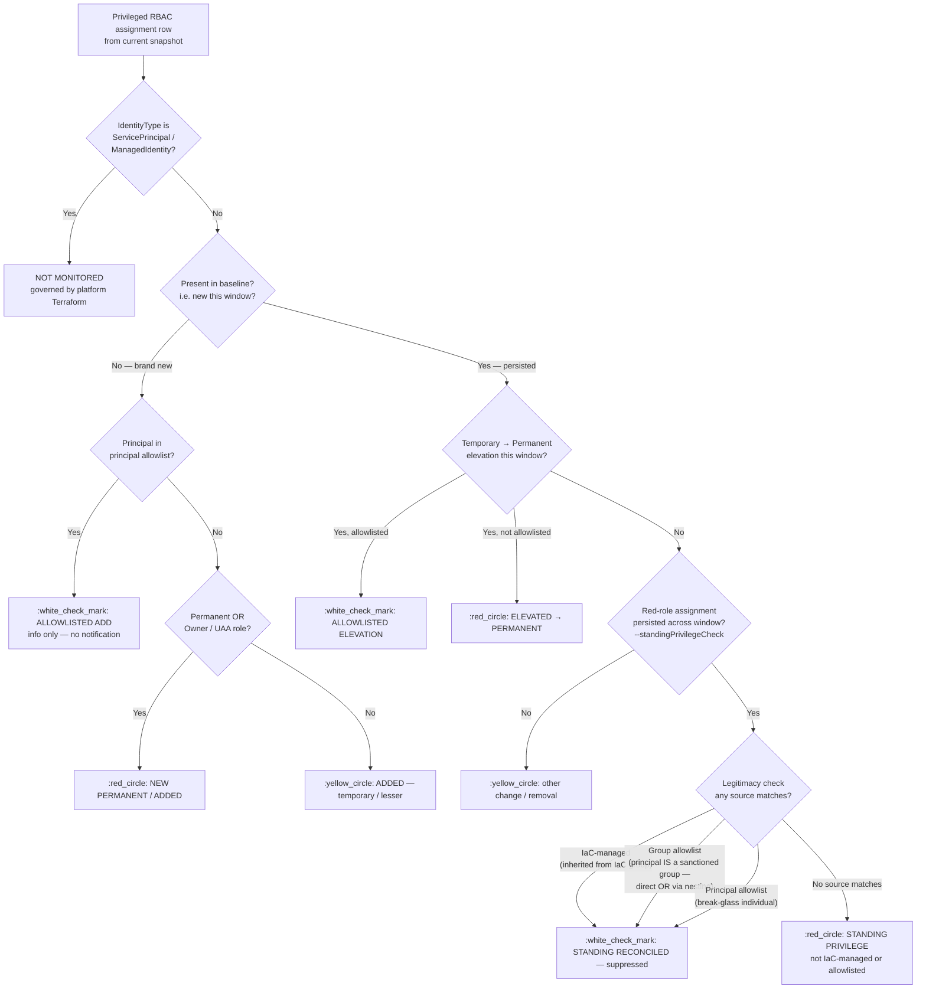

# Privileged RBAC change monitoring

This folder implements continuous detection of privileged Azure RBAC drift by
comparing timestamped snapshots and reconciling standing privilege against
Infrastructure-as-Code (IaC) declarations. The guiding principle is an inverted
baseline: **anything that is not declared in IaC (or explicitly allowlisted) is
red-flagged**, so a manually granted elevation cannot "age out" of alerting and
poison the baseline.


# items of concern
roles need to be monitored - definition of priv admin roles goes by perms not by rolename, if a new priv role is released which we haven't got on the audit list - this is a blindspot
role scope not covered (if you grant reader role owner across the estate )
api permissions not covered
service principals /managed identities not covered

# intended functionality
all assignments to permissive groups should be done in iac via azure access
should alert for users who activate access package repeatedly for monitoring purposes
script only monitors human users and short term permission scope creep

script should update it's source of truth from azure-access
allow list only for covering break glass accounts
investigate list for the DCD /ancient groups that need looking at

malicious entry into legit eligible groups is not monitored

malicous modification of allowlist
doesnt monitor subs or tenants that the SP has no read access to
holistic monitoring via access reviews, azgovviz and service principals + other posture monitoring is still required

## Components

### `extract-iac-groups.sh`
Emits (one display name per line on stdout) the set of Entra security-group
display names that are provisioned or governed by IaC, unioned across three
HMCTS governance repositories — the **three sources of truth**:

| Source repo | What is extracted |
| --- | --- |
| `azure-access` | Per-user group memberships (`users/prod_users.yml`) and declared groups (`users/groups.yml`). |
| `azure-access-packages` | Quoted `"DTS ..."` groups referenced as catalog resources / package `resource_roles` — the groups granted on access-package activation (`entitlement-catalogs.yml`, `entitlement-packages.yml`). |
| `azure-enterprise` | Terraform-provisioned groups, expanded by interpolating a fixed set of group *types* (Owners, Contributors, Readers, AKS Admins, Key Vault Admins, PIM "Eligible", etc.) over the management-group ids, subscription names and environment names declared in the prod component/tfvars. Plus static IaC-created groups (e.g. `DTS Global Admins`). |

Repo locations default to sibling checkouts under `$HOME/Git` and can be
overridden per-repo via `AZURE_ACCESS_DIR`, `AZURE_ACCESS_PACKAGES_DIR` and
`AZURE_ENTERPRISE_DIR` for CI checkout paths. Output is `sort -u`'d and intended
to be passed to the monitor via one or more `--iacGroupsFile` arguments.

### `rbac-change-monitor.sh`
Compares two privileged-RBAC snapshot CSVs (produced by
`audit-privileged-rbac*.sh`) over a window (default **2 days**) and writes a
Slack-ready report using the shared marker convention:

| Marker | Meaning |
| --- | --- |
| `:red_circle:` | New Permanent privileged assignment, any added Owner / User Access Administrator, or a Temporary → Permanent elevation. |
| `:yellow_circle:` | Other added / removed / changed assignments. |
| `:white_check_mark:` | Allowlisted principal self-adding / self-elevating (informational only; never triggers a notification on its own). |

Snapshot resolution relies on the filenames being sortable UTC timestamps, with
a `.meta.json` coverage manifest sitting beside each CSV so a genuinely
shrunken snapshot can be told apart from an incomplete audit (coverage
loss/gain is surfaced as its own alert rather than a flood of bogus
adds/removals).

## Membership origin — how a principal got into a privileged group

A row whose `AssignmentSource` is `InheritedGroupTransitiveMember` tells you a
principal holds a role **because they are a member of a privileged group** — but
not *how that membership was obtained*. The snapshot's `MembershipOrigin` column
(produced by `audit-privileged-rbac-p.sh`) classifies that, so a governed
self-service grant can be told apart from a raw direct add (the higher-risk,
ungoverned path):

| `MembershipOrigin` | Meaning |
| --- | --- |
| `AccessPackage` | Direct member; membership was delivered by an **Entra access-package assignment** (governed self-service). |
| `PIMActivated` | Direct member; membership is an **active PIM just-in-time activation**. |
| `PIMAssigned` | Direct member; membership is a **standing PIM-assigned** group role. |
| `DirectAdd` | Direct member with **no** access-package or PIM record — added straight to the group (manual / script / IaC). The path to scrutinise. |
| `NestedGroupMember` | Reached the role **via a nested group**, not by direct membership of the role-holding group; the origin is attributable to that nested group's own row. |
| `Unknown` | Origin data could not be read (missing Graph permission — see below). |
| `N/A` | Not a group-membership row (a direct role assignment, group owner, or PIM-eligible row). |

The monitor surfaces this on group-inherited and standing-privilege lines as
`…; membership: <origins>`.

### Graph permissions required on the audit service principal

`MembershipOrigin` is populated from Microsoft Graph. Grant these **application**
permissions to the audit identity's app registration and **admin-consent** them
**in the tenant that owns the groups** (app-only, since it runs unattended):

| Graph application permission | Enables |
| --- | --- |
| `EntitlementManagement.Read.All` | Read access-package assignments + resource roles → the `AccessPackage` classification. |
| `PrivilegedAccess.Read.AzureADGroup` | Read PIM group eligibility **and** active assignment schedule instances → `PIMActivated` / `PIMAssigned` (also already needed for eligible-member coverage). |
| `GroupMember.Read.All` | Read `/groups/{id}/members` and `/transitiveMembers` to distinguish direct from nested membership. |
| `User.Read.All` | Resolve principal object IDs to UPN / display name (usually already granted). |

Each is independently pre-flighted: if one is missing the audit **degrades
gracefully** (logs a one-line warning naming the permission, records
`entitlementReadable` / `pimActiveReadable` / `pimEligibleReadable` in the
`.meta.json`, and emits `Unknown` rather than a false `DirectAdd`) instead of
failing. A confident `DirectAdd` is only asserted when **both** the entitlement
and PIM-active reads succeeded.

> **Attribution caveat.** `MembershipOrigin` says *how* the membership exists,
> not *who added it or when*. For actor + timestamp on a manual add you need the
> directory audit log (`AuditLog.Read.All`, `auditLogs/directoryAudits`), which
> is out of scope for this snapshot.

## The standing-privilege check (`--standingPrivilegeCheck`)

A plain snapshot diff only sees **transitions**. A privileged grant left in
place long enough ages into the baseline and becomes invisible — a malicious
self-elevation would normalise and stop alerting, poisoning the baseline.

With `--standingPrivilegeCheck` enabled, the monitor re-derives from the
**current** snapshot every red-role assignment that has **persisted across the
window** (present in the baseline too) and is **neither allowlisted nor
legitimised by IaC**, and re-alerts on it every run until it is removed or
explicitly approved.

Legitimacy is decided by three sources, in order of preference:

1. **Terraform IaC** (`--iacGroupsFile`): an assignment inherited from — or
   granted directly to — a group declared in IaC is treated as managed/approved.
2. **Group allowlist** (`--groupAllowlistFile`, default `group-allowlist.txt`):
   governance **groups** that are sanctioned to hold standing privileged roles.
   This is the intended model — privilege is carried by a group whose membership
   is itself governed (PIM-eligible activation / access packages), not assigned
   to individuals — so a sanctioned group holding a permanent privileged role is
   expected and suppressed. Matches on group **display name or object-ID GUID**
   only; it never matches a user UPN, so a user with a **direct** grant can never
   be silenced through it.
3. **Principal allowlist** (`--allowlistFile`, default `allowlist.txt`):
   individual principals (by object ID / UPN) sanctioned to hold a direct grant,
   for the rare cases a direct assignment is genuinely approved.

A direct assignment is not recognisable as IaC-managed from the group-name
source, so it must be covered by the principal allowlist (or, if it is a group,
the group allowlist) if legitimate. Service principals and managed identities
are excluded (governed by platform Terraform elsewhere).

> **Both allowlist files must be committed.** They are read from the pipeline's
> fresh checkout; an untracked file is invisible to the agent and suppresses
> nothing (every listed principal/group would still alert).

Coverage is continuous and non-overlapping:

- the diff covers a grant's **first** window (NEW / ADDED), and
- the standing check covers it from the **second** window onward,

so the two checks never double-report.

## Decision flow — what alerts and what doesn't

Every privileged assignment row from the current snapshot is routed through the
logic below. The three legitimacy sources are consulted in precedence order
(IaC → group allowlist → principal allowlist); a match on **any** of them
suppresses a standing-privilege alert.



### What SHOULD alert (`:red_circle:`)

| Scenario | Why it alerts |
| --- | --- |
| A **user** gains a privileged role by adding themselves to a privileged group (e.g. joining `DTS Owners (mg:HMCTS)`), and is **not** a break-glass individual. | The principal's identity type is `User`, so neither allowlist clears it. Self-elevation via group membership is exactly the abuse path being watched. |
| A **user** holds a **direct** permanent privileged assignment not declared in IaC and not allowlisted. | Direct individual grants are never IaC-managed and are not sanctioned unless explicitly break-glass. |
| A nested **group** that is **not** in IaC or the group allowlist holds / inherits a privileged role. | An ungoverned group carrying standing privilege is drift. |
| A new **Permanent** assignment, or any added **Owner / User Access Administrator**, appears this window. | First-window red transition (diff path). |
| A **Temporary → Permanent** elevation on an existing assignment (not allowlisted). | A time-bound grant being made standing. |
| A red-role grant **persists** into later windows without an IaC/allowlist match. | The standing-privilege check re-alerts every run so it can't "age out" of the baseline. |

### What SHOULD NOT alert

| Scenario | Outcome | Why |
| --- | --- | --- |
| A group **declared in IaC** holds a standing privileged role. | Suppressed (`STANDING RECONCILED`). | Governed by Terraform — the approved model. |
| A **sanctioned governance group** in `group-allowlist.txt` holds a privileged role — **directly OR transitively** (nested inside another privileged group). | Suppressed (`STANDING RECONCILED`). | Privilege lives on a group whose membership is itself governed (PIM-eligible / access packages). The check matches the **principal group** by display name or object-ID GUID, regardless of how it reached the role. |
| A **break-glass individual** in `allowlist.txt` self-adds, self-elevates, or holds a sanctioned direct grant. | `:white_check_mark:` info only (or suppressed standing). | Explicitly approved exception; informational, never a notification on its own. |
| A **service principal / managed identity** holds a privileged role. | Not monitored. | Governed by platform Terraform elsewhere; out of scope for this membership/access-package reconciliation. |
| A pre-existing assignment becomes visible only because a subscription's audit **coverage was gained** this run. | Collapsed into a single `AUDIT COVERAGE GAINED` note. | A recovered blind spot is not a fresh grant. |

> **Critical distinction:** the group allowlist suppresses a **group** principal
> holding privilege; it can **never** suppress a **user**. A user who inherits
> privilege through membership in an allowlisted group still alerts and can only
> be cleared individually via the principal allowlist (break-glass). This keeps
> the sanctioned model (privilege on governed groups) distinct from the abuse
> path (individuals self-joining those groups).

## Typical invocation

```bash
# 1. Build the IaC-managed group allowlist from the three sources of truth.
./extract-iac-groups.sh > /tmp/iac-groups.txt

# 2. Compare the two newest snapshots in the current dir, with the inverted
#    "not-in-IaC is red" standing-privilege baseline enabled.
./rbac-change-monitor.sh \
  --currentDir . \
  --iacGroupsFile /tmp/iac-groups.txt \
  --groupAllowlistFile group-allowlist.txt \
  --standingPrivilegeCheck \
  -o rbac-change-status.txt
```
